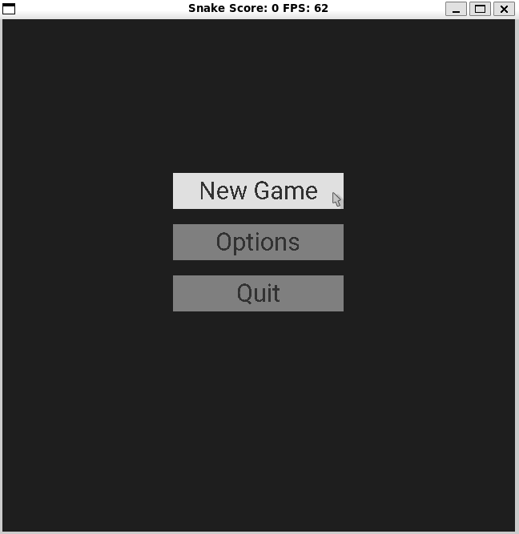

# CPPND: Capstone Improved Snake Game

This the capstone project based on the starter repo for the Capstone project in the [Udacity C++ Nanodegree Program](https://www.udacity.com/course/c-plus-plus-nanodegree--nd213). The code for this repo was inspired by [this](https://codereview.stackexchange.com/questions/212296/snake-game-in-c-with-sdl) excellent StackOverflow post and set of responses.


## Dependencies for Running Locally
* cmake >= 3.7
  * All OSes: [click here for installation instructions](https://cmake.org/install/)
* make >= 4.1 (Linux, Mac), 3.81 (Windows)
  * Linux: make is installed by default on most Linux distros
  * Mac: [install Xcode command line tools to get make](https://developer.apple.com/xcode/features/)
  * Windows: [Click here for installation instructions](http://gnuwin32.sourceforge.net/packages/make.htm)
* SDL2.0, SDL_TTF2.0 and SDL_IMAGE 2.0
  - Linux(Ubuntu): Install using `sudo apt-get install -y libsdl2-dev libsdl2-image-dev libsdl2-ttf-dev`
  - Mac and Windows: [Click here for installation instructions](https://wiki.libsdl.org/Installation)
* gcc/g++ >= 5.4
  * Linux: gcc / g++ is installed by default on most Linux distros
  * Mac: same deal as make - [install Xcode command line tools](https://developer.apple.com/xcode/features/)
  * Windows: recommend using [MinGW](http://www.mingw.org/)

## Basic Build Instructions

1. Clone this repo.
2. Make a build directory in the top level directory: `mkdir build && cd build`
3. Compile: `cmake .. && make`
4. Run it: `./SnakeGame`.


## Improvements 

Added two new screens; Menu and Game Over. Also added a new type of food. This food's color is red and it is flashing when it is available. It is only available after five regular food is eaten for 5 seconds. 

In the menu screen there are three buttons for starting a new game, options and quitting the game. Options button is only a place holder for further improvements. 



On the Game over screen score is displayed and there is a button to start a new game. 


## Project Structure

Main loop structure is kept same. Control, Update and Render functions are extended for different screen behaviors.

```
project
│   README.md
│
└─── assets #font/image assets
│   │
│   └─── font #Font used for the game
|   │
│   └─── images #Button faces
│
└─── src # implementation details for classes(detailed explanation below)
|    │   button_texture.h      # Class that defines the render behavior of the button
|    │   button.h              # Class for creating button items on the screen
|    │   controller.h          # Class to process user input 
|    │   dynamic_element.h     # Base class for Button and Text Label
|    │   game.h                # Main class to run the game
|    │   renderer.h            # Class for rendering the game
|    │   snake.h               # Snake item used in the game
|    │   text_label.h          # Class for displaying text on the screen
|    │   typedefs.h            # Types used in the project
|    │   button_texture.cpp      
|    │   button.cpp     
|    │   controller.cpp    
|    │   dynamic_element.cpp    
|    │   game.cpp    
|    │   renderer.cpp    
|    │   snake.cpp
|    │   text_label.cpp        
|    │   typedefs.cpp    
|    │   main.cpp               #main function
│
└───.gitignore
│
└───CMakeLists.txt
│
└───README.md
```

## Addressed Some Rubric Criterias

- **The project uses multithreading:** A second thread is used to create flashing behavior of the special food in `game.cpp`

- **A mutex or lock is used in the project:** Mutex and lock guardian mechanism is used to read and write operation for the toggle paramenter in `game.cpp`.

- **Overloaded functions allow the same function to operate on different parameters:** `HandleInput` funtion in `controller.cpp`. and `Render` function in `renderer.cpp` are overloaded for different screens.

- **Derived class functions override virtual base class functions:** `DynamicElement` class is defined as a base class for `Button` and `TextLabel` classes. Input handling and rendering behaviors of these classes are overriden.

- **Templates generalize functions in the project:** To assign an event handler to the `Button` object, a template function is declared in the `button.h`. Different functions can be assigned for different button object events. 

- **The project makes use of references in function declarations:** Various functions uses references in the project. 